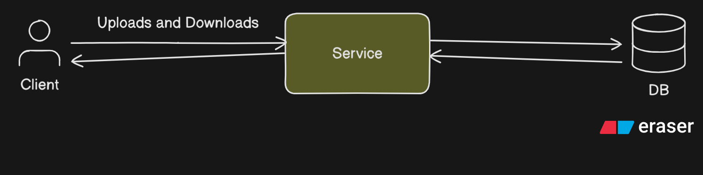

# Design

## Components

1. Service
    - Handles Uploads and downloads and interacting with the Database.
2. Storage
    - Single Storage node which will store both File Data as well as the meta data of the file.



## Failures

### Network Failure during Uploads

- Network interruption during an upload causes the request to fail mid-transfer. Since uploads are handled as a single synchronous operation, partially written files may exist, and the client must restart the upload from the beginning.
- Handling
    
    To address network failures during uploads, the system evolves to support chunked uploads. Files are split into fixed-size chunks, each uploaded independently via a dedicated Upload Service. The Upload Service manages upload sessions and tracks successfully persisted chunks, enabling clients to resume uploads after interruptions. Chunk uploads are idempotent to allow safe retries without data corruption.
    
    - Solutions Aspects
        - How are upload session created?
            - When user send an initial request to the service for uploading the file which includes metadata like (File Name, total chunks len etc).
            - In response server create an upload session and in response it provides unique session_id, upload_url, expiration time etc.
            - Based on the upload_url user start uploading all the chunks and after final chunk send the completion message to the server.
            - When server receives the completion it aborts the session.
        - How does a client resume it?
            
            I have two approaches for this question.
            
            1. Sequential Chunk uploads
                - Chunks will be uploaded Sequentially and last successfully uploaded chunk will be maintained in the upload session.
                - So, I uploading fails midway due to network, then chunk will resume from after the latest successfully stored chunk.
            2. Random Chunk uploads
                - Sequence of the chunks in the approach will not matter as, upload session will maintain the list of chunk id which will be stored successfully.
                - So, client just have to check whether the chunk is uploaded or not.
        - When is it finalized?
            
            We can finalize upload if all the chunks are uploaded successfully and stored in sequential order in the file storage and matches the expected file size given during the creation of upload session.
            
        - What happens if the service crashes mid-chunk?
            
            Storing the upload session in DB/Disk for persistence, so that after a crash the session information can be fetched from DB/Disk.
            
        - How are abandoned uploads cleaned up (conceptually)?
            
            if expiration of the upload session is completed, then session will be discarded.
            
    


### Server Crash

- If the service crashes during an upload or download, in-flight operations are lost. Partially written files may be left in an inconsistent state, and clients must retry without knowing which data was persisted.
- Handling
    - During uploads, file data is associated with an upload session and marked `IN_PROGRESS`. Files in this state are not visible to download requests. A file becomes downloadable only after the upload session is finalized and the file state is transitioned to `FINALIZED`. Any crash before finalization leaves the file invisible and safe from partial reads.
    - File States
        - `IN_PROGRESS`
        - `AVAILABLE`
    - Upload Session States
        - `ACTIVE`
        - `COMPLETED`
    - Chunk State
        - `Missing`
        - `Stored`
    - Visibility Rule - If File State == FINALIZED then downloadable.
    - Finalization Flow
        - Client requests upload completion.
        - Upload Service validates:
            - All chunks present
            - File size matches expectation
        - **Atomically**:
            - Mark file state as `AVAILABLE`
            - Mark upload session state as `COMPLETED`
        - Return success to client.
    - Download Rules
        - If File State is `AVAILABLE`, then downloadable as per the access rule.
        - else File Not Exists return 404.


### Concurrency of Operations

- With a single service handling all uploads and downloads, concurrent operations contend for shared resources (CPU, memory, disk, database connections), causing degraded performance and increased latency under concurrent usage.
- Handling
    
    ## How I think about the problem
    
    I do **not** think of this as:
    
    - “two finalize requests”
    - “duplicate API calls”
    - “client retry”
    
    I think of it as:
    
    > Multiple actors attempting to perform the same irreversible commit.
    > 
    
    Finalization is not an operation — it is a **decision**.
    
    And in distributed systems, **decisions must be single-winner**.
    
    ---
    
    ## Core intuition
    
    > Finalization must have exactly one linearization point.
    > 
    
    Meaning:
    
    - There must exist a single, well-defined instant in the system’s history
    - After that instant, the file is finalized
    - Before that instant, it is not
    - No in-between states are observable
    
    If two finalization attempts run concurrently:
    
    - One of them *must* be the winner
    - The other *must* observe that the decision is already made
    
    Anything else creates ambiguity, which leads to partial commits.
    
    ---
    
    ## What makes this scenario dangerous
    
    The danger is **not** duplicate finalization itself.
    
    Idempotency solves that.
    
    The real danger is this interleaving:
    
    1. Finalize A validates chunk completeness
    2. Finalize B validates chunk completeness
    3. Finalize A commits
    4. Finalize B commits based on stale validation
    
    This is how **partial or incorrect files get finalized**.
    
    So the problem is **split-brain validation**, not retries.
    
    ---
    
    ## My governing principle for 3.3
    
    > Validation and commit must be inseparable.
    > 
    
    If the system:
    
    - validates chunks
    - then later commits finalization
    
    …then concurrency can slip in between.
    
    Therefore, from a reasoning standpoint:
    
    - Either the system observes *all chunks and commits*
    - Or it observes *not all chunks and does not commit*
    - No other outcome is allowed
    
    ---
    
    ## Mental invariant for 3.3
    
    - At most one finalization commit may succeed
    - All other finalization attempts must observe the committed state
    - No finalization attempt may commit based on stale state
    
    This is a **single-writer decision problem**, not a retry problem.
    
    ---
    
    # 3.5 Upload After Finalization
    
    **(Late chunk uploads after commit)**
    
    ---
    
    ## How I think about the problem
    
    This is **not** about lateness.
    
    It is about **immutability enforcement**.
    
    Once a file is finalized, the system has made a public promise:
    
    > “This file will never change.”
    > 
    
    Breaking that promise even once destroys trust in the system.
    
    ---
    
    ## Core intuition
    
    > Finalization draws a hard boundary between mutable and immutable history.
    > 
    
    Everything before that boundary:
    
    - is allowed to mutate
    
    Everything after:
    
    - must be read-only forever
    
    Late chunk uploads are simply **writes that crossed the boundary**.
    
    And writes that cross the boundary are invalid by definition.
    
    ---
    
    ## What I explicitly reject as reasoning
    
    I do **not** care that:
    
    - the client sent the chunk earlier
    - the network delayed it
    - the client was unlucky
    
    Distributed systems do not reward intent.
    
    They reward **state correctness**.
    
    ---
    
    ## Governing principle for 3.5
    
    > After finalization, mutation is forbidden — not discouraged, not ignored, forbidden.
    > 
    
    This means:
    
    - No new chunks
    - No overwrites
    - No “cleanup writes”
    - No “best effort acceptance”
    
    Immutability is absolute, or it is meaningless.
    
    ---
    
    ## Mental invariant for 3.5
    
    Once `file_state == AVAILABLE`:
    
    - Chunk set is frozen
    - Storage is append-forbidden
    - All write paths are logically closed
    - The only valid operations are reads
    
    This must hold even under:
    
    - retries
    - delayed packets
    - duplicated requests
    - crashes and restarts
    
    ---
    
    ## How 3.3 and 3.5 relate (important insight)
    
    These two are **coupled problems**:
    
    - 3.3 defines **when** the commit happens
    - 3.5 defines **what is allowed after** the commit
    
    If either is weak:
    
    - finalization becomes ambiguous
    - immutability becomes aspirational
    - corruption becomes possible
    
    A correct system:
    
    - makes finalization a single irreversible decision
    - makes post-finalization mutation impossible by definition
    
    ---
    
    ## Summary (Senior-level framing)
    
    - **3.3 is about single-winner commitment**
    - **3.5 is about absolute immutability**
    - Both must be enforced by state, not timing
    - Both must survive retries, races, and crashes
    - Client intent and request order are irrelevant
    
    Once these two are closed properly, your upload pipeline becomes **correct-by-construction**, and only then is it safe to think about performance, parallelism, or replication.
    
    If you want, next we can:
    
    - derive **formal invariants** from this
    - test this logic against adversarial timelines
    - or translate this into enforceable state rules
    
    You’re asking the right questions.
    
    Now I want all the discussed approach for all subsection of Concurrency we have Solved.
    
    Below is a **single, consolidated, design-document-ready write-up** covering **all concurrency subsections that we have discussed and (fully or conceptually) solved** so far.
    
    This is written in a **senior, invariant-driven style**, not conversational, and can be pasted directly into your project documentation.
    
    ---
    
    # Concurrency Handling — Design Approach
    
    This section documents how concurrency failures are addressed in the system. The design prioritizes **correctness under retries, crashes, and out-of-order execution**, independent of client behavior or request timing.
    
    ---
    
    ## 1. Concurrent Chunk Uploads (Same Session)
    
    ### Scenario
    
    Multiple concurrent upload attempts target the same chunk index within a single upload session. This may occur due to:
    
    - Network retries
    - Duplicate client requests
    - Client or service restarts
    
    This can happen even with a single client.
    
    ### Risk if Unchecked
    
    - Duplicate chunk writes
    - Overwrites with inconsistent data
    - Corrupted final file
    
    ### Design Approach
    
    Chunk upload is treated as an **idempotent, single-writer state transition** enforced at the storage layer.
    
    Each chunk is uniquely identified by `(session_id, chunk_index)` and transitions atomically from `MISSING` to `STORED`.
    
    ### Governing Rules
    
    - Only the first successful write for a given `(session_id, chunk_index)` is allowed.
    - Duplicate writes with identical payloads are treated as no-ops and return success.
    - Duplicate writes with differing payloads are rejected as data integrity violations.
    - Overwrites are never permitted.
    
    ### Result
    
    - Exactly one physical chunk is stored.
    - Chunk data is immutable once written.
    - Concurrency and retries converge safely without locks or timing assumptions.
    
    ---
    
    ## 2. Concurrent Resume Attempts
    
    ### Scenario
    
    The same upload session is resumed concurrently from multiple clients or devices. Each client independently determines which chunks are missing and attempts to upload them.
    
    ### Risk if Unchecked
    
    - Duplicate chunk uploads
    - Inconsistent session progress tracking
    - Data corruption
    
    ### Design Approach
    
    Concurrent resume attempts are reduced to the same problem as concurrent chunk uploads.
    
    Session progress is **derived from persisted chunk state**, not from client-side assumptions or in-memory session metadata.
    
    ### Governing Rules
    
    - Chunk existence is the source of truth.
    - Chunk upload rules from Section 1 apply unchanged.
    - No session-level locking or ownership is required.
    
    ### Result
    
    - Multiple resume attempts converge deterministically.
    - Session metadata remains consistent.
    - No additional concurrency mechanisms are needed.
    
    ---
    
    ## 3. Concurrent Finalization Requests
    
    ### Scenario
    
    The client sends a `completeUpload` request, but due to network timeout or retry logic, multiple finalization requests execute concurrently.
    
    ### Risk if Unchecked
    
    - File finalized multiple times
    - Partial chunk sets finalized
    - Inconsistent or incorrect file state
    
    ### Design Approach
    
    Finalization is treated as a **single-winner, irreversible commit decision**, not as a regular request.
    
    The system enforces a **single linearization point** at which the file transitions from mutable to immutable.
    
    ### Governing Principles
    
    - At most one finalization commit may succeed.
    - Validation of chunk completeness and the commit decision must be inseparable.
    - All other concurrent finalization attempts must observe the committed state.
    
    ### Key Invariant
    
    - `IN_PROGRESS → AVAILABLE` is a one-way, atomic transition.
    - Once committed, the decision is globally visible and irreversible.
    
    ### Result
    
    - Duplicate finalization requests converge idempotently.
    - Partial or stale validations cannot commit.
    - Finalization is safe under concurrency and retries.
    
    ---
    
    ## 4. Upload + Download Race
    
    ### Scenario
    
    A download request arrives while the upload is near completion, potentially overlapping with the arrival of the final chunk or the finalization request.
    
    ### Risk if Unchecked
    
    - Downloading partial or corrupted data
    - Violation of atomic visibility guarantees
    
    ### Design Approach
    
    Visibility is strictly gated by file state.
    
    Downloads are permitted **if and only if** the file is finalized.
    
    ### Governing Rules
    
    - Files in `IN_PROGRESS` state are treated as non-existent.
    - Only files in `AVAILABLE` state are downloadable.
    - No partial visibility is allowed.
    
    ### Result
    
    - Downloads never observe partial data.
    - Read correctness is guaranteed independent of timing.
    - Upload and download concurrency is safely eliminated by state, not coordination.
    
    ---
    
    ## 5. Upload After Finalization (Late Chunk Uploads)
    
    ### Scenario
    
    A chunk upload request that was initiated before finalization arrives after the file has already been finalized, due to network delay or retry.
    
    ### Risk if Unchecked
    
    - File mutation after being marked complete
    - Violation of immutability guarantees
    - Silent data corruption
    
    ### Design Approach
    
    Finalization is treated as a **hard commit boundary** separating mutable and immutable history.
    
    Once the file is finalized, all mutation is forbidden.
    
    ### Governing Principles
    
    - Client intent and request timing are irrelevant.
    - Only the authoritative file state matters.
    - Writes observed after finalization are invalid by definition.
    
    ### Key Invariant
    
    Once `file_state == AVAILABLE`:
    
    - The chunk set is frozen.
    - No new chunks may be added.
    - No existing chunks may be modified.
    - All write paths are logically closed.
    
    ### Result
    
    - Immutability is enforced absolutely.
    - Late writes cannot affect finalized files.
    - The system remains correct under retries, delays, and crashes.

### High Latency Downloads

- Read Latency Failure
    - Reads are slow because each download request performs a full disk read from primary storage. Popular files are read repeatedly, causing read amplification and disk contention with concurrent uploads, increasing tail latency under concurrent load.
- Cache Invariants
    - Cache only AVAILABLE files
    - Cache never mutates data
    - Cache failure is non-fatal
    - Eviction: LRU
- Why not chunk level caching?

> Because it increases complexity and failure modes without providing meaningful benefit at our current scale.
> 

### Database Crash

- Since file data and metadata are stored in a single storage node, a storage failure makes all files unavailable, resulting in complete data unavailability.
- Handling
    
    ## 1. DB Crash Failure (Disk Survives)
    
    ### Definition
    
    DB crash means the **service or database process stops**, but **disk data may partially persist**.
    
    Examples:
    
    - Process crash
    - Power loss during write
    - OS restart
    
    In-memory state is lost.
    
    ---
    
    ### Core Invariant
    
    ```
    file.state == AVAILABLE
    ⇒fileis complete, immutable,and readable
    
    ```
    
    Must hold **even after restart**.
    
    ---
    
    ### Storage Assumptions (Minimal)
    
    - DB metadata transactions are atomic
    - Filesystem `rename()` is atomic
    - File writes may be partial or lost
    
    ---
    
    ### Design Principles
    
    - Metadata controls visibility
    - Data is written before metadata
    - One irreversible commit point
    - Restart is a normal execution path
    
    ---
    
    ### Chunk Write Protocol
    
    1. Write data to temp file
    2. Flush and close
    3. Atomic rename to final file
    4. Write chunk metadata
    
    Crash result:
    
    - Partial data → invisible
    - Orphaned data → safe
    - No corrupted visible chunks
    
    ---
    
    ### Finalization (Commit Boundary)
    
    - Single irreversible transition:
        
        ```
        file.state: IN_PROGRESS → AVAILABLE
        
        ```
        
    - Happens in one atomic DB transaction
    - Retry-safe and idempotent
    
    ---
    
    ### Recovery on Restart
    
    - Trust `AVAILABLE` files
    - Reconcile `IN_PROGRESS` files from chunks
    - Derive session progress from stored data
    - Ignore temp files
    - Mark orphaned data for cleanup
    
    ---
    
    ### Result
    
    - No partial or corrupted files visible
    - Safe retries after crash
    - Deterministic recovery
    
    ---
    
    ## 2. Disk Crash Failure (Disk Loss)
    
    ### Definition
    
    Disk crash means **persisted data itself is lost or corrupted**.
    
    Examples:
    
    - Disk failure
    - VM ephemeral storage loss
    - Filesystem corruption
    
    Restart logic alone is insufficient.
    
    ---
    
    ### New Requirement
    
    ```
    Acknowledged data must survive loss ofa single disk
    
    ```
    
    ---
    
    ### Key Concept
    
    Durability now requires **replication**.
    
    ---
    
    ### Senior Design Rules
    
    - Replicate only commit-critical data
    - Replication is part of the commit path
    - Partial replication is treated as a crash
    - Idempotency and retries still apply
    
    ---
    
    ### Replication Scope
    
    Replicate:
    
    - Chunk data
    - Chunk metadata
    - File metadata
    
    Do not replicate temp or intent state eagerly.
    
    ---
    
    ### Commit Redefined
    
    Commit succeeds **only when all replicas acknowledge**.
    
    ---
    
    ### Crash Handling with Replication
    
    - One replica fails → recover from other
    - Both fail → data loss acknowledged
    - Metadata still governs visibility
    
    ---
    
    ### Result
    
    - Data survives single disk loss
    - Correctness preserved under hardware failure
    - Foundation for high availability and scale
    
    ---
    
    ## One-Line Mental Models (Important)
    
    - **DB crash**: “Process died, disk survived — reconcile.”
    - **Disk crash**: “Data died — replication required.”
    - **Correctness**: “A system is correct when it restarts.”
    - **Durability**: “Success is acknowledged only after survival is guaranteed.”

### Observability Failure

- Observability is limited because logs and metrics are generated and stored within the same service process. A service crash results in loss of in-flight logs, making failures hard to diagnose.

### Operator Questions

- How do I know an upload is stuck vs slow?
    - An upload is slow if new chunk_persisted facts continue to appear over time.
    - An upload is stuck if no new chunk_persisted fact has been recorded beyond threshold.
- How do I know which chunk is missing?
    - The system maintains a persisted per-chunk record or derives it from chunk_persisted events.
    - Any chunk index with no corresponding persisted record/event is missing.
- How do I know finalization failed due to validation vs replication?
    - The system record a durable finalized_started fact. Followed by
        - Finalization_Replication_Failed
        - Finalization_Validation_Failed
        - Finalized_Completed
    - Based on the last outcome we can decide finalization failed on which scenario.
    
- How do I know which invariant blocked progress?
    - The system records a durable invariant_violation fact whenever progress is blocked.
        
        This record includes the invariant identifier (e.g., `ALL_CHUNKS_PRESENT`) and the blocking condition.
        
        The most recent `invariant_violation` fact explains exactly which rule prevented progress.
        
    
- After a crash, how do I know what phase the file was in?
    
    
    The system records durable phase-transition facts such as:
    
    - `upload_completed`
    - `finalization_started`
    - `finalization_completed`
    - 
    
    After a crash, the latest recorded phase-transition fact determines exactly which phase the file was in and how recovery should proceed.
    

- How do I know whether data was ACKed or not?
    
    The system records a durable ack_issued fact only after data is safely persisted.
    
    If an ack_issued fact exists, the operator knows the client was allowed to stop retrying.
    
    Absence of this fact means ACK may not have been sent or must be treated as unsafe.
    

### Event Model for Observability

- Ack_Issued   ( Related to acknowledgement )
    - `chunk_ack_issued`
    - `upload_ack_issued`
    - `finalization_ack_issued`
- Finalization_Started ( Related to finalization phase failure)
    - 
    - `finalization_started`
    - `finalization_validation_failed`
    - `finalization_replication_failed`
    - `finalization_completed`
- Invariant_Violation
    - `invariant_violation_all_chunks_present`
    - `invariant_violation_single_finalizer`
    - `invariant_violation_duplicate_chunk`
- Chunk_Persited
    - `chunk_persisted_primary`
    - `chunk_persisted_replica`
    - `chunk_duplicate_rejected`

Minimal Event Set

### Upload lifecycle

- `upload_session_created`
- `chunk_persisted_primary`
- `chunk_duplicate_rejected`
- `chunk_ack_issued`

### Finalization lifecycle

- `finalization_started`
- `finalization_validation_failed`
- `finalization_replication_failed`
- `finalization_completed`

### Invariant enforcement

- `invariant_violation_<type>`

### Visibility

- `file_became_available`

Every irreversible decision now:

- leaves evidence
- has a cause
- has a timeline

### Failure - Observability Mapping

### 1️⃣ Server crash mid-upload

| Aspect | Answer |
| --- | --- |
| **Failure** | Upload service crashes while chunks are being uploaded |
| **What operator looks for** | Last successfully persisted chunk index |
| **Durable evidence** | `chunk_persisted_primary` events |
| **Explanation** | All chunks with a `chunk_persisted_primary` event are durable. Absence of the next chunk’s event proves progress stopped before that chunk. |
| **Why this is safe** | Crash does not erase persisted events; retry resumes from last durable chunk. |

---

### 2️⃣ Duplicate chunk upload

| Aspect | Answer |
| --- | --- |
| **Failure** | Client retries and uploads the same chunk again |
| **What operator looks for** | Proof that the chunk already existed |
| **Durable evidence** | `chunk_duplicate_rejected` event |
| **Explanation** | Presence of this event proves idempotency logic fired and prevented duplicate persistence. |
| **Why this is safe** | Duplicate handling is explicit, not inferred from state. |

---

### 3️⃣ Finalization retry

| Aspect | Answer |
| --- | --- |
| **Failure** | Client retries finalization due to timeout or crash |
| **What operator looks for** | Whether finalization was already attempted |
| **Durable evidence** | `finalization_started` event |
| **Explanation** | Presence of this event proves a prior attempt occurred. Retry behavior depends on presence or absence of `finalization_completed`. |
| **Why this is safe** | Finalization is single-writer and idempotent. |

---

### 4️⃣ Replication failure

| Aspect | Answer |
| --- | --- |
| **Failure** | Primary storage succeeded but replica write failed |
| **What operator looks for** | Proof that replication did not complete |
| **Durable evidence** | `finalization_replication_failed` event |
| **Explanation** | This event distinguishes replication failure from validation failure or crash. |
| **Why this is safe** | File is not made visible until replication succeeds. |

---

### 5️⃣ ACK lost

| Aspect | Answer |
| --- | --- |
| **Failure** | Data persisted but ACK response never reached client |
| **What operator looks for** | Whether ACK was *issued*, not received |
| **Durable evidence** | `chunk_ack_issued` or `upload_ack_issued` event |
| **Explanation** | Presence of ACK event proves client was allowed to stop retrying. Absence means retry must be treated as unsafe. |
| **Why this is safe** | ACK truth is independent of network delivery. |

---

### 6️⃣ Concurrent finalization

| Aspect | Answer |
| --- | --- |
| **Failure** | Two finalization attempts race |
| **What operator looks for** | Proof that invariant blocked one attempt |
| **Durable evidence** | `invariant_violation_single_finalizer` event |
| **Explanation** | This event proves concurrency control worked and explains rejection cause. |
| **Why this is safe** | Prevents double visibility and split-brain finalization. |

Final Diagram 

