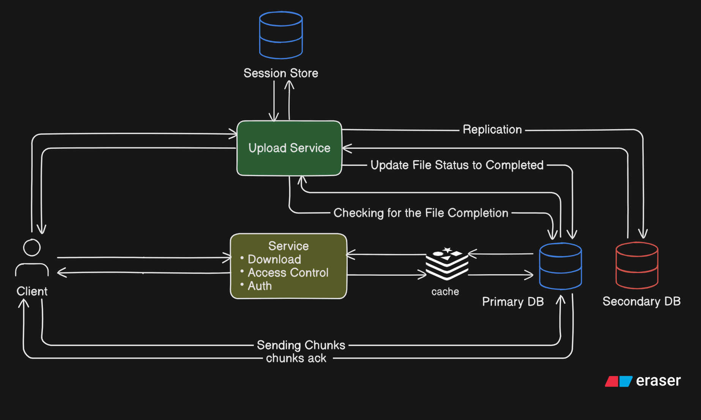

# Flows



---

# Upload & Download Execution Flows

These flows define the **invariant-preserving execution layer** of the object storage system.

They ensure correctness under **crashes, retries, and concurrency**.

---

# Create Upload Session

## API Endpoint

```
POST /files
```

## Purpose

Creates a new file and an upload session in a **single atomic operation** so that:

- No session exists without a file
- No file exists without an owner

## Transactional Flow

```
BEGIN TRANSACTION

1. Insert into File with status = IN_PROGRESS
2. Insert into FileUserInfo with role = OWNER
3. Insert into Session with status = ACTIVE

COMMIT
```

## Enforced Invariants

```
Session.ACTIVE ⇒ File.IN_PROGRESS exists
File.IN_PROGRESS ⇒ owner exists
```

---

# Upload a Chunk

## API Endpoint

```
POST /files/chunks
```

## Request Body

```json
{
  "sessionId": "...",
  "chunkSeqNum": 7,
  "payload": "<binary>"
}
```

## Purpose

Stores one chunk in a **crash-safe and idempotent** way.

## Execution Flow

```
1. Write payload to temp file
2. fsync(temp file)
3. rename(temp file → final chunk path)

BEGIN TRANSACTION
4. Insert SessionChunk(sessionId, seqnum, chunk_path, STORED)
COMMIT
```

## Why this order

Disk must be durable **before** the database is updated.

## Enforced Invariants

```
SessionChunk.STORED ⇒ chunk_path exists on disk
(sessionId, seqnum) is unique
```

---

# Finalize Upload

## API Endpoint

```
POST /files/finalize
```

## Request Body

```json
{
  "sessionId": "..."
}
```

## Purpose

Assembles all chunks into the final file, replicates it, and makes it visible **atomically**.

---

## Phase 1 — Freeze & Validate

```
BEGIN TRANSACTION

1. SELECT Session FOR UPDATE
2. Verify Session.status == ACTIVE
3. Verify all chunks exist
4. UPDATE File SET status = FINALIZING

COMMIT
```

Prevents concurrent finalization and chunk writes.

---

## Phase 2 — Build & Replicate (No DB transaction)

```
1. Assemble chunks → temp_final
2. fsync(temp_final)

3. Copy to secondary → temp_final_replica
4. fsync(temp_final_replica)

5. rename(temp_final → final_path_primary)
6. rename(temp_final_replica → final_path_secondary)
```

At this point:

- Both replicas are durable
- File is still invisible

---

## Phase 3 — Make it Visible

```
BEGIN TRANSACTION

1. UPDATE File SET status = AVAILABLE
2. UPDATE Session SET status = COMPLETED

COMMIT
```

## Enforced Invariants

```
File.AVAILABLE ⇒ file exists on all replicas
Session.COMPLETED ⇒ no more chunk writes allowed
```

---

# Download File

## API Endpoint

```
GET /files/download?fileId=<fileId>&userId=<userId>
```

## Flow

```
1. Fetch File by fileId
2. Verify File.status == AVAILABLE
3. Verify FileUserInfo allows access
4. Return object store link or stream file
```

## Enforced Invariant

```
Only AVAILABLE files are readable
```

---